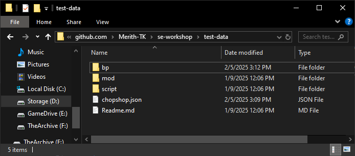
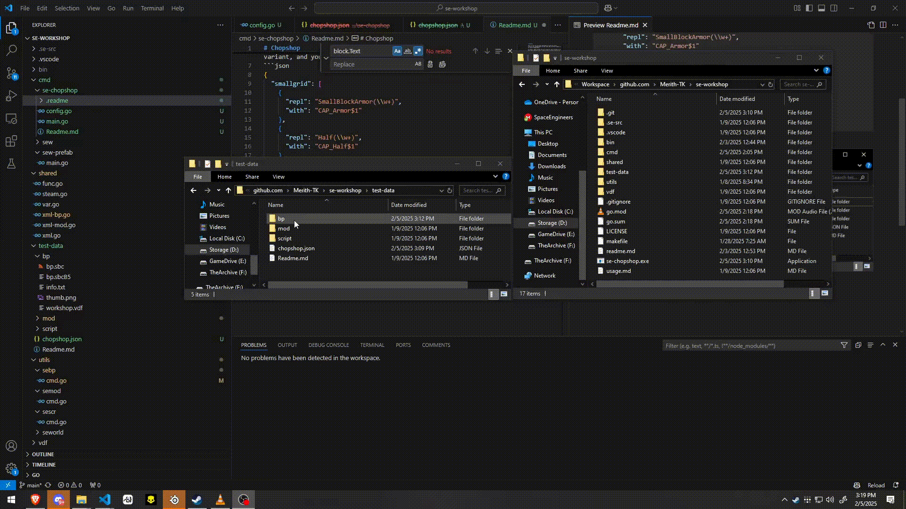

# Chopshop

This is a tool for easy mass replacement of blocks on a grid, primarily for swapping heavy to light armor and vice-versa, however it can handle modded blocks. 

It supports regex configs, here is a config for small airships on the Naval Space Engineers server []"Wave Breakers"!](https://discord.gg/Hmw6R8JUbZ)
It converts all small grid armor blocks to the lightweight aircraft variant, and you can swap the regex to convert it back!
```json
{
  "smallgrid": [
    {
      "repl": "SmallBlockArmor(\\w+)",
      "with": "CAP_Armor$1"
    },
    {
      "repl": "Half(\\w+)",
      "with": "CAP_Half$1"
    }
  ],
  "largegrid": []
}
```

Place the config in `chopshop.json` next to your blueprints like so
,

and then drag and drop the desired blueprint's folder onto the exe,  like so, ,

